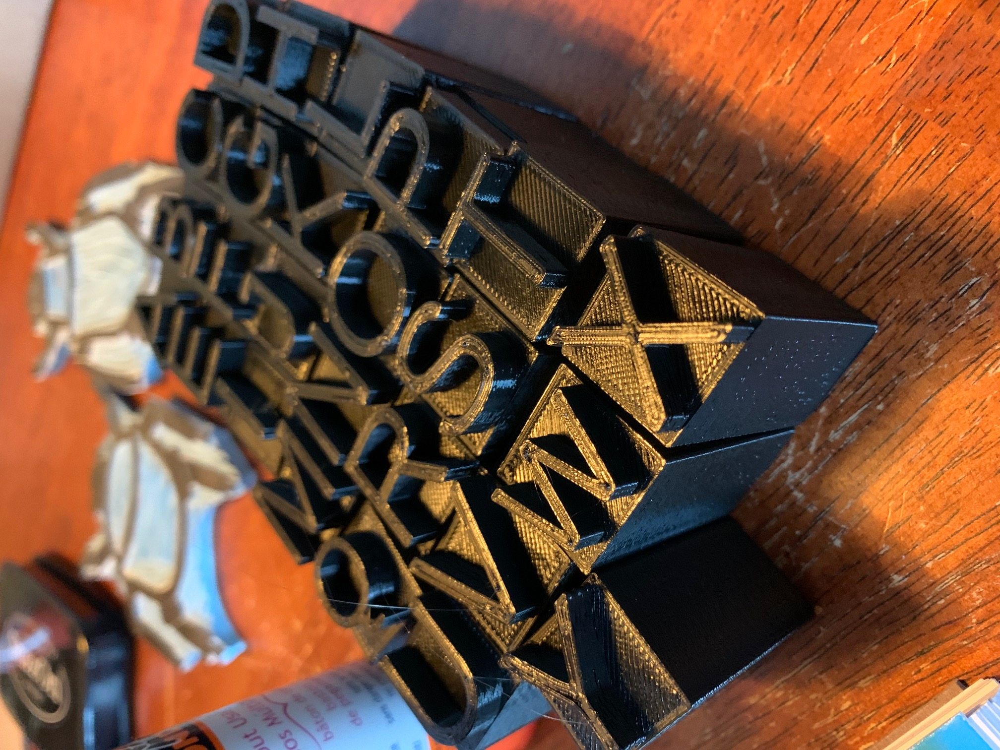

# letters

Models of letters for printing, etc.

## Usage

A number of models in STL format are provided under subdirectories labled for the "footprint" (mm square) size of the part.

Models are created using OpenSCAD code generated by [lettergen.py](./lettergen.py).  The first argument is the size of the part footprint, the second argument is the length of the handle.

### Example

`python lettergen.py 20 40`

## TODO

* Add rendering and STL export to lettergen.py
* Add more command line options (output directory, fonts, etc.)
